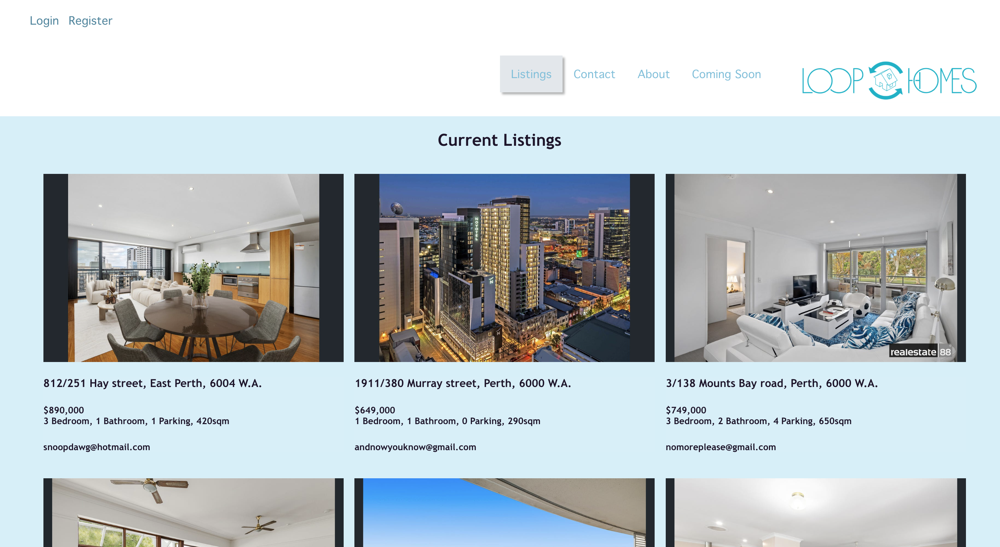
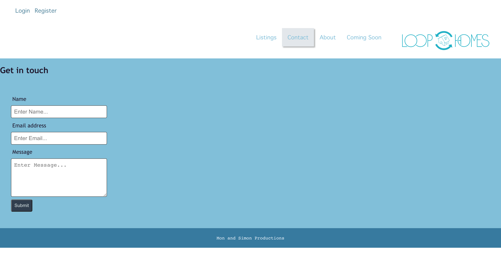
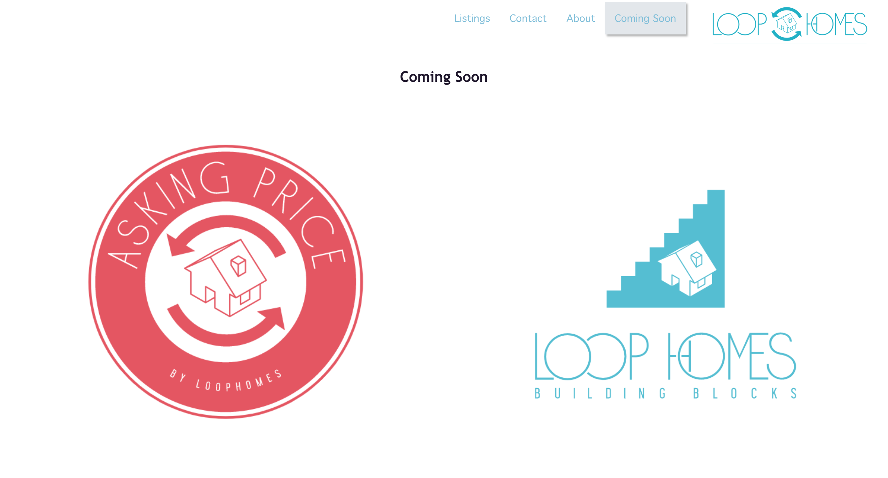

## Table of Contents

- [Description](#description)
- [Installation](#installation)
- [Usage](#usage)
- [Images](#images)
- [Repository](#repository)
- [Production](#production)
- [Questions](#questions)

## Description

Loop Homes is a user interface that connects seller’s with potential buyers - erasing the middle man and thus erasing some of larger costs of selling your home. A free marketplace where sellers can advertise their properties and interact with buyers of their own choosing, within a timeframe that suits their personal needs and availability. We understand that homeowners are more than capable of finding potential buyers, and we at Loop Homes have given them the platform to do just that…

## Installation

`npm i express dotenv mongoose`

`npm i express-async-handler`

`npm i`

## Usage

Run the following command at the root of your project and check the app

`npm start server`

## Login

## Contributors

[Monique Levey](https://github.com/monlevey)

[Simon Levey](https://github.com/lev8947)

## Images

## Future Developments

## Repository

You can get the code in the following link. https://github.com/monlevey/loop-homes
## Production

You can check the app in following link. 

## Questions

Contact us with any questions: 

Simon Levey: [email](lev_47@hotmail.com) , [GitHub](https://github.com/lev8947) 
Monique Levey: [email](mon_beetle@hotmail.com) , [GitHub](https://github.com/monlevey) 

## Loop Homes is a collaboration by the Levey's :)