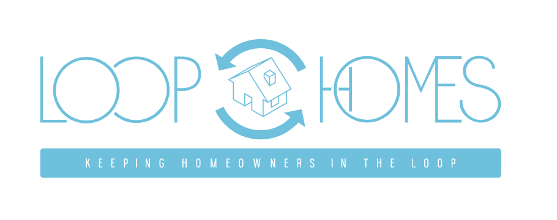

## Table of Contents

- [Description](#description)
- [Installation](#installation)
- [Usage](#usage)
- [Login](#login)
- [Image](#image)
- [Repository](#repository)
- [Production](#production)
- [Contributing](#contributing)
- [Questions](#questions)

## Description

Loop Homes is a user interface that connects seller’s with potential buyers - erasing the middle man and thus erasing some of larger costs of selling your home. A free marketplace where sellers can advertise their properties and interact with buyers of their own choosing, within a timeframe that suits their personal needs and availability. We understand that homeowners are more than capable of finding potential buyers, and we at Loop Homes have given them the platform to do just that…

## Installation

`npm i express dotenv mongoose`

`npm i express-async-handler`

`npm i`

## Usage

Run the following command at the root of your project and check the app

`npm start server`

## Login

Public user type login detail
username : vini@gmail.com
password : 123456

Vendor type login detail
username : kayal@gmail.com  
password : 123456

## Contributors

[Monique Levey](https://github.com/monlevey)

[Simon Levey](https://github.com/lev8947)

## Image

## Repository

You can get the code in the following link. https://github.com/sreevinithaa/EventFoodie.git

## Production

You can check the app in following link. https://eventfoodie.herokuapp.com/

## Questions

Contact me with any questions: [email](mailto:sreevinithaa@gmail.com) , [GitHub](https://github.com/sreevinithaa) 

# loop-homes

this is by mon

Loop homes is a collaboration by the Levey's :)

backend installation
npm i express  dotenv  mongoose  colors  express-asyn-handler

**make sure dotenv is in backend with MONGO_URI

npm i
npm start